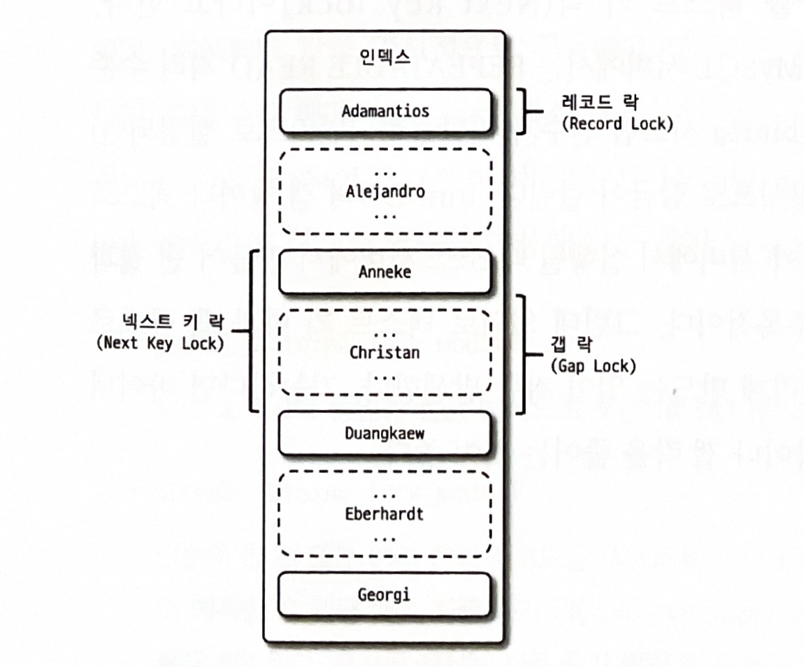

# InnoDB 스토리지 엔진 잠금

- 레코드 기반의 잠금 방식 덕분에 MyISAM 보다 훨씬 뛰어난 동시성 처리를 제공할 수 있다.

- MySQL 서버의 information_schema 데이터베이스에 존재하는 테이블들을 조회하면 어떤 트랜잭션이 어떤 잠금을 대기하고 있고, 해당 잠금을 어느 트랜잭션이 가지고있는지 확인할 수 있다.

## 5.3.1 InnoDB 스토리지 엔진의 잠금

- 일반 DBMS와 다르게 InnoDB 스토리지 엔진에서는 레코드 락 뿐만 아니라 레코드와 레코드 사이의 간격을 잠그는 갭 락이라는 것이 존재한다.

### 5.3.1.1 레코드 락

- 레코드 자체만을 잠그는 것을 레코드 락 이라고 함.

- InnoDB 스토리지 엔진은 레코드 자체가 아니라 인덱스의 레코드를 잠금.

- 인덱스가 없는 테이블이더라도 내부적으로 자동 생성된 클러스터 인덱스를 이용해 잠금을 설정함.

### 5.3.1.2 갭 락

- 갭 락은 레코드 자체가 아니라, 레코드의 바로 인접한 레코드 사이의 간격만을 잠그는 것을 의미함.

- 갭 락의 역할은 레코드와 레코드 사이의 간격에 새로운 레코드가 생성되는것을 제어함.

### 5.3.1.4 자동 증가 락

- 자동 증가하는 숫자 값을 채번하기 위해 AUTO_INCREMENT라는 칼럼 속성을 제공하는데, 동시에 여러 레코드가 INSERT 되는 경우 중복되지 않고 저장된 순서대로 증가하는 값을 가져야한다.

- InnoDB 스토리지 엔진에서는 이를 위해 내부적으로 AUTO_INCREMENT 락을 사용한다.

- AUTO_INCREMENT 락은 명시적으로 획득하고 해제하는 방법은 없다. 아주 짧은 시간동안 걸렸다가 해제되는 잠금이라 대부분의 경우 문제가 되지 않는다.

- innodb_autoinc_lock_mode라는 시스템 변수를 이용해 자동 증가 락의 작동 방식을 변경할 수 있다.

## 5.3.2 인덱스와 잠금

- InnoDB의 잠금은 레코드를 잠그는 것이 아니라 인덱스를 잠그는 방식으로 처리되는데, 변경해야 할 레코드를 찾기 위해 검색한 인덱스의 레코드를 모두 락을 걸어야 한다.

- 만약 인덱스가 설정되어있지 않다면 레코드 UPDATE 작업 시에 테이블 풀 스캔이 일어나게되며, 모든 레코드가 잠기게 된다.

- MySQL의 InnoDB에서 인덱스 설계까 중요한 이유이다.

## 5.3.3 레코드 수준의 잠금 확인 및 해제

- MySQL 5.1 부터는 레코드 잠금과 잠금 대기에 대한 조회가 가능하기 때문에 쿼리 하나만 실행해 보면 바로 확인할 수 있다.

- MySQL 8.0 버전부터는 performance_schema의 data_locks와 data_lock_waits 테이블을 이용해 잠금, 잠금 대기 순서를 확인할 수 있다.

