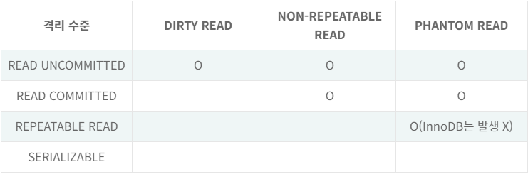
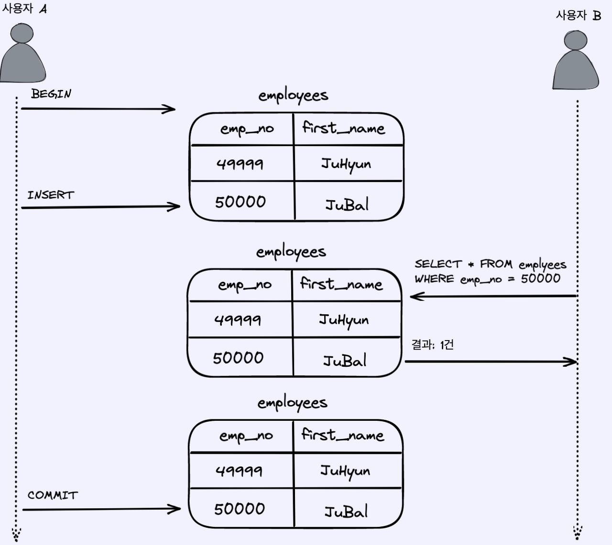
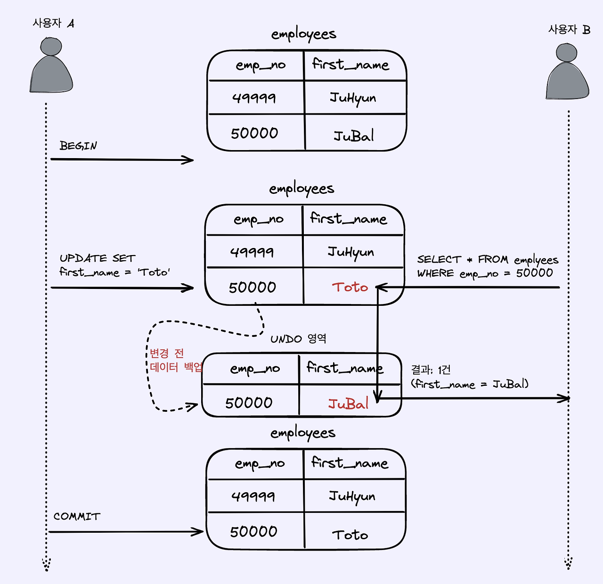
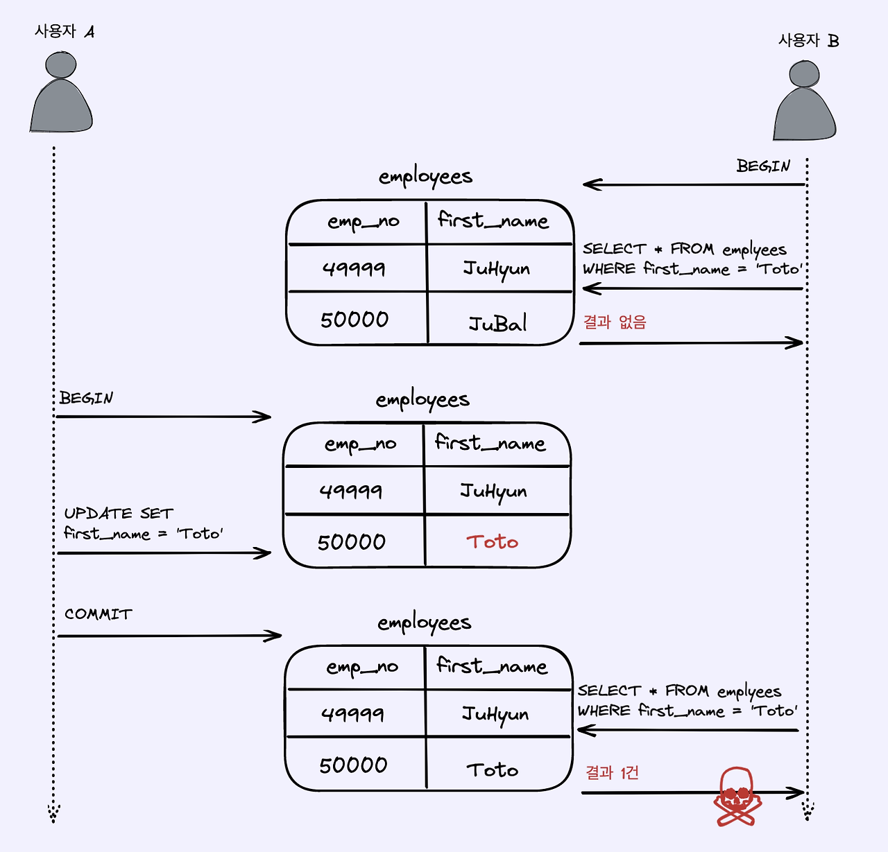

# 5.4 MySQL의 격리 수준

- 트랜잭션의 격리 수준이란 여러 트랜잭션이 동시에 처리될 때 특정 트랜잭션이 다른 트랜잭션에서 변경하거나 조회하는 데이터를 볼 수 있게 허용할지 말지를 결정하는 것이다.

- 격리 수준은 크게 READ UNCOMMITTED, READ COMMITTED, REPEATABLE READ, SERIALIZABLE의 4가지로 나뉜다.

- 4개의 격리 수준에서 순서대로 뒤로 갈수록 트랜잭션 간의 데이터 격리 정도가 높아지고, 동시 처리 성능이 많이 떨어진다.

    

- InnoDB는 독특한 특성 때문에 REPEATABLE READ 격리 수준에서 PHANTOM READ가 발생하지 않는다.

## 5.4.1 READ UNCOMMITTED

- 사용자 A가 트랜잭션을 시작하고, emp_no가 500000인 레코드를 INSERT 한다.

- 그 이후에 사용자 B가 해당 레코드를 조회했을 때, 사용자 A의 트랜잭션이 Commit으로 끝나지 않았음에도 불구하고 해당 결과를 조회할 수 있게 된다.

- 이 과정에서 rollback이 발생했음에도 불구하고 사용자 B는 해당 레코드가 정상적인 결과라고 생각하는 참사가 벌어진다.

- 이처럼 어떤 트랜잭션에서 처리한 작업이 완료되지 않았음에도 다른 트랜잭션에서 볼 수 있는 현상을 더티 리드(Dirty Read)라 한다.

- 더티 리드 현상은 데이터가 나타났다 사라졌다 하는 현상을 초래하기 때문에 RDBMS 표준에서는 트랜잭션의 격리 수준으로 인정하지 않을 정도로 정합성에 문제가 많은 격리 수준이다.

## 5.4.2 READ COMMITTED

- READ COMMITTED는 더티 리드 같은 현상은 발생하지 않는데, Commit이 완료된 데이터만 다른 트랜잭션에서 조회할 수 있기 때문이다.

    

- 사용자 A는 emp_no가 500000인 사원의 first_name을 변경했는데, 이 때 새로운 값은 그 즉시 테이블에 기록되고, 이전 값은 언두 영역으로 백업된다.

- 사용자 A가 커밋하기 전 사용자 B가 해당 사원을 조회했을 때, 언두 영역에서 백업된 레코드를 가져오기 때문에 변경된 값이 아닌 트랜잭션 시작 전 값을 들고오게 되는것이다.

- 사용자 A가 최종적으로 커밋하게 되면 그때부터는 다른 트랜잭션에서도 백업된 언두 레코드가 아니라, 새롭게 변경된 값을 참조할 수 있게 된다.

- READ COMMITTED 격리 수준에서도 부정합이 발생하는데, 자세한 예시는 다음과 같다.

    

- 처음 사용자 B가 트랜잭션을 시작한 후 first_name이 'Toto'인 회원을 조회했을 때, 결과가 없음으로 조회될 것이다.

- 그 이후에 사용자A가 해당 레코드의 first_name을 'Toto'로 변경하고, Commit을 한다고 가정해보자. 사용자B가 사용자 A의 커밋 이후에 다시 해당 데이터를 조회한다면 결과를 가져올 수 있게된다.

- 하나의 트랜잭션에서는 동일 데이터를 여러 번 읽어도 항상 똑같은 결과가 보장되어야 하는데, 이 경우에는 해당되지 않는다.

- 예를들어 다른 트랜잭션에서 입금과 출금 처리가 계속 진행될 때, 다른 트랜잭션에서 오늘 입금된 금액의 총합을 조회한다고 가정하면, REPEATABLE READ가 보장되지 않기 때문에 SELECT 쿼리가 실행될 때 마다 다른 결과를 가져올 것이다.